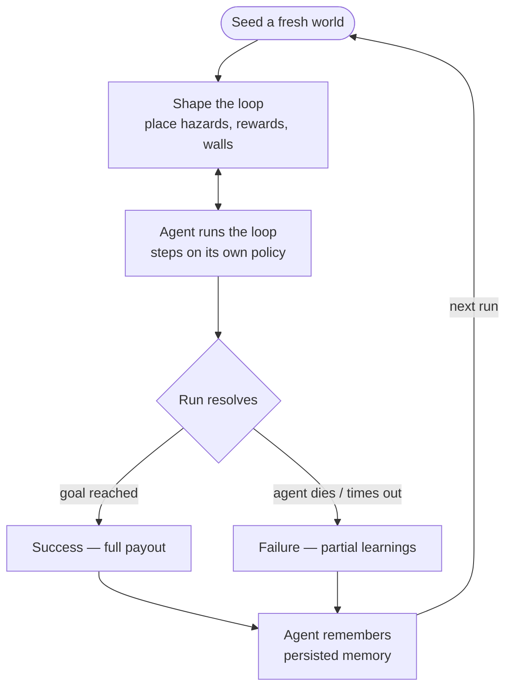

# Core Loop — MVP Design (XRC-78)

> One run, end to end: **shape the loop → the agent traverses on its own → it resolves →
> you refine between runs.** This is the spine the whole game hangs off. This doc turns the
> XRC-78 concept into a concrete, buildable MVP that nests inside the `Session` run sub-FSM
> already shipped (XRC-95).

## 1. The fantasy (why this is singular)

You don't play the hero. **You train the autonomous agent that does.** You never move the
agent directly — you author the world it learns in, then watch it act on its own learned
policy. The differentiator is *legibility*: at every moment you can read **why** the agent
does what it does, and across runs you watch it visibly get smarter.

## 2. The run, as a loop



The **Shape ↔ Run interleave** is the core tension: while the agent is moving you keep
placing tiles. Every placement is *both* a teaching signal (steer it toward rewards / away
from danger) *and* a survival risk (a wall can trap it, a misread hazard can kill it).

This maps 1:1 onto the run sub-FSM (`RunSubMachine`, XRC-95):
`Seeding → Shaping ⇄ AgentRunning → Resolving → RunSuccess | RunFailed`.

## 3. The board (the tabletop world)

- A small grid, **8×8** for MVP, generated deterministically from `RunContext.Seed`.
- Each cell has a type: `Empty`, `Wall`, `Hazard`, `Reward`, `Start`, `Goal`.
- Seeding places exactly one `Start` and one `Goal` (opposite regions) on otherwise empty
  terrain. No hand-authored content yet — the seed is the level.
- The **agent** has a position (starts on `Start`) and `Hp` (MVP: 3).

## 4. Shaping (the player's verb)

- The player places tiles from a small palette onto `Empty` cells: **Hazard**, **Reward**,
  **Wall**. (`Start`/`Goal` are fixed.)
- A placement budget creates pacing — a few tiles per agent step (the interleave). MVP:
  1 placement available per agent step, banked up to a small cap.
- Validation: can't place on non-empty cells, can't fully wall off the goal (a reachability
  check rejects a placement that would strand the agent — no soft-locks).

## 5. The agent (the trained one)

The agent is **autonomous** and **legible**. Each step it picks the neighbouring cell that
minimises a transparent cost function, then moves.

```
stepCost(cell) = 1                       // base move
              + Hazard ? HAZARD_COST : 0  // avoid danger
              + dangerMemory[cell]        // learned aversion (see §6)
              - rewardPull(cell)          // attraction to nearby reward + reward memory
heuristic     = manhattan(cell, goal)     // greedy toward the goal
```

- It walks a weighted greedy / A* path toward `Goal`, recomputed each step (so it reacts to
  tiles placed mid-run — the interleave).
- Stepping onto a `Hazard` costs 1 `Hp` (and is remembered). Stepping onto a `Reward`
  collects it (`Score += REWARD_VALUE`, consumed, and remembered).
- Walls are impassable; if boxed in with no path, it waits one step then takes the least-bad
  move (never a hard crash).

**Readout (the transparent-agent pillar, XRC-79):** the agent always exposes its *intended
next cell* and a one-line reason ("seeking reward at (5,2)", "avoiding (3,4) — hurt here
last run"). MVP surfaces at least the intended next step + reason.

## 6. Training = persistent memory

This is the heart of "training", kept deliberately simple and **readable**:

- **Danger memory:** every cell where the agent took damage accrues an aversion weight that
  *persists across runs*. Next run, the agent routes around places that hurt it before.
- **Reward memory:** cells where it collected a reward accrue a mild attraction.
- Memory decays slowly so the agent stays adaptable.

Memory is the agent's "trained" state. It is **persisted on the save profile** (XRC-92) as a
compact serialized blob and reloaded each run, so the player watches the *same* agent get
smarter over a session. `agentXp` increments with experience; memory is the visible payoff.

> MVP keeps the model to weighted pathfinding + per-cell memory — not ML. It is enough to
> deliver the fantasy (autonomous, improves across runs, legible) and is fully deterministic
> and unit-testable.

## 7. Resolution & payout

- **Success:** agent reaches `Goal` with `Hp > 0`. Outcome `Success`; `Score` = rewards
  collected + a goal bonus.
- **Failure:** `Hp` hits 0 (death) or the run exceeds `MAX_STEPS` (timeout). Outcome
  `Failure`; partial `Score` kept.
- Both feed Results (XRC-97), which commits the payout to the profile, **and** both persist
  the agent's updated memory — the refine loop.

This fills in `RunContext` (`Score`, `PlacedTiles`, `AgentAlive`) and produces the existing
`RunOutcome`, so Session → Results already works unchanged.

## 8. MVP build plan (issues)

| System | Issue | What ships |
| -- | -- | -- |
| Board model + seeding | (new) | `RunBoard` grid, cells, agent, deterministic seeding |
| Agent policy + memory | (new) | weighted step, hazard/reward resolution, persistent memory + readout |
| Run driver + Session integration | (new) | tick loop interleaving shaping/agent, resolution, drives `RunSubMachine`, persists memory |
| Board visualization + placement | (new) | world-space grid render, agent + intent, tap-to-place tiles |

Each is engine-light and unit-testable (the model/policy/driver are plain C#), then wired to
the world-space UI. Definition of MVP done: **a full run plays start→resolve, the agent
visibly avoids where it died last run, and the outcome commits to the save and returns to the
Hub** — the complete loop, playable.

## 9. Out of scope for MVP (later)

- Threat variety / bosses (XRC-82), biomes, multiple agent archetypes (XRC-80).
- Deep economy / upgrade trees (XRC-83) — MVP uses the existing currency/XP payout.
- Real ML policies; networked/cloud saves; final art & VO.
